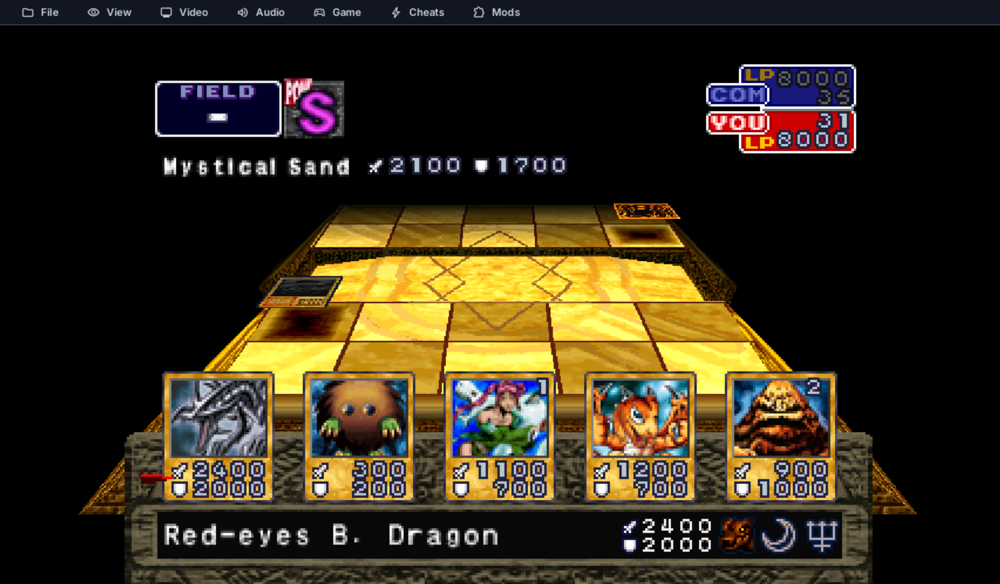
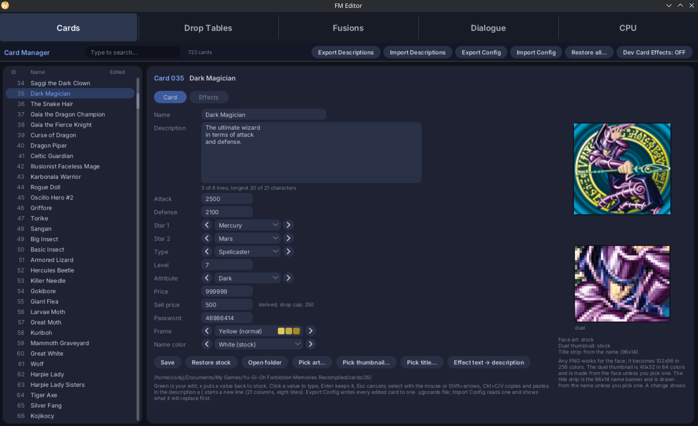
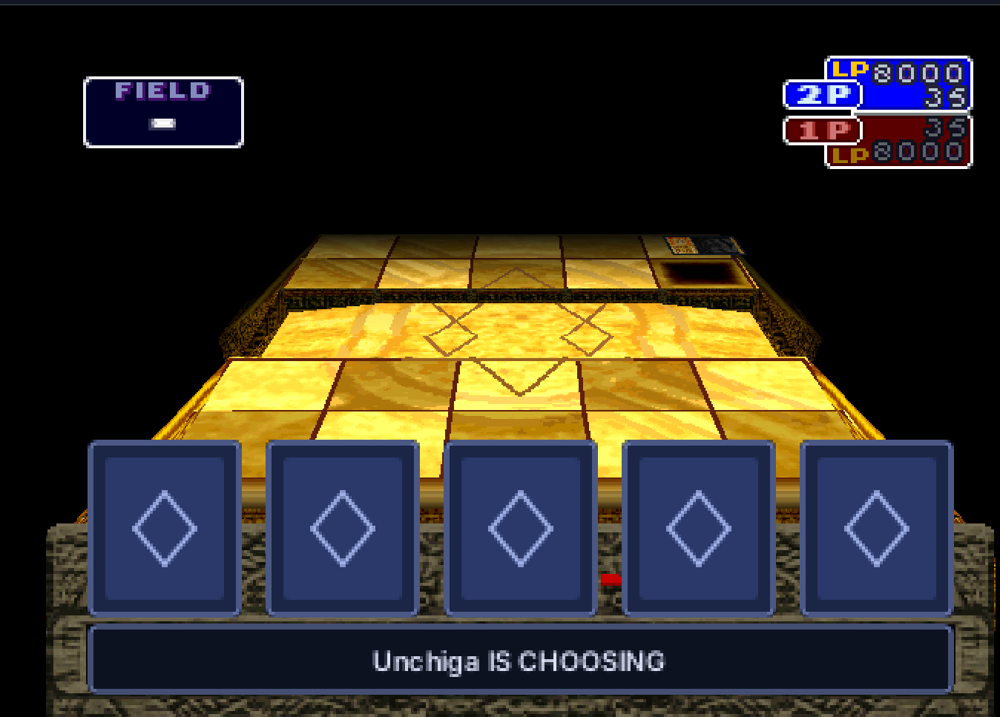

# Yu-Gi-Oh! Forbidden Memories Recompiled

A static recompilation of **Yu-Gi-Oh! Forbidden Memories** (USA,
SLUS-01411). The game's MIPS code is translated to C ahead of time and built
as a native executable instead of being interpreted by an emulator.



Built on [PSXRecomp](https://github.com/mstan/psxrecomp).

> **Bring your own disc.** Neither this repository nor its downloads contain
> the game's code or data. Your copy is verified and recompiled locally on the
> first run.

| | |
|---|---|
| Supported game | SLUS-01411 (USA / NTSC-U) |
| Players | 1-2, including netplay |
| BIOS | OpenBIOS, bundled |

## Version 0.6.0

**The FM Editor + netplay update.** Existing saves, save states and settings
carry over when you extract it over an existing install.

- One resizable **FM Editor** for Cards, Drop Tables, Fusions, Dialogue and CPU
  duelists
- Card Shop selling, bulk controls, card viewing and protected buy/sell prices
- More accurate netplay privacy and working player-two fusion hints
- Complete monster-effect queues and fixes for attached Dark Hole and Dragon
  Capture Jar effects
- Lighter 2x-4x play at high resolutions with native-rate rendering

See the [full 0.6.0 release notes](RELEASE_NOTES.md#060) for every change and
fix.

## Highlights

### FM Editor (`F10 → VIEW → FM EDITOR`)

The five persistent tabs cover the whole modding workflow in one resizable
window:

| Tab | What it edits |
|---|---|
| Cards | Names, descriptions, stats, passwords/prices, artwork, colors, effects, triggers, equips, fields and rituals |
| Drop Tables | All 117 rank tables, guaranteed drops, Smart Drops and conditional StarChip rewards |
| Fusions | Every recipe in both directions, including equip pairings |
| Dialogue | All campaign dialogue, with automatic wrapping and capacity checks |
| CPU | Deck pools, AI values, names, portraits and Free Duel records |



Edits are applied live and stored beside your saves; your disc and save data
are not patched. Card descriptions support the game's full eight-line,
21-character layout without overflowing adjacent data.

### Card Shop and passwords (`F10 → MODS → CARD SHOP`)

Passwords appear on full card-detail views. The expanded shop supports direct
password purchases, four types of card packs and selling cards from your
collection.


`TRIANGLE` opens Sell. Left/Right changes quantity, L1/R1 moves ten cards,
Square selects all copies, Start or R2 selects the trunk, L2 clears the
selection, and Triangle views a card. A review screen prevents accidental
sales, and deck cards are never sold.

Direct-card and pack resale values are capped so no purchase can be resold for
a profit. The FM Editor shows both authored sell prices and their effective
shop caps.

### Netplay

Open **Netplay** in the pre-game launcher to host or join through the online
lobby, LAN or a direct address. Each player supplies a matching game disc.



Opponent hands are covered from the first draw frame, and private full-card
views remain hidden through their closing animation. Public card views stay
visible. The fusion assistant follows the local seat, including player two,
and never exposes the other player's hand.

Save-changing mods and the FM Editor are unavailable during stock netplay so
both peers remain deterministic. Offline choices remain saved.

### Gameplay additions

Everything below is available from the `F10` menu and takes effect without
patching the disc or restarting:

| Feature | Summary |
|---|---|
| Duel rank | Live POW/TEC grade, optionally with the raw score |
| Fusion assistant | Marks the best fusion order and can name the result |
| Card drops | Awards 0-99 cards and adds a pageable results screen |
| Drop missing cards | Gives sources to the 82 cards absent from stock drop tables |
| Library placeholders | Reveals card information without granting ownership |
| Free Duel completion | Shows owned/obtainable progress per opponent |
| Card Effects set | Adds adapted effects to the original cards; off by default |
| Widescreen | Experimental native 16:9 duel field with 4:3 menus |
| Cheats | LP, opponent-hand visibility, StarChips, free spending and inventory controls |

The runtime also provides save states (`F7`), rewind (`F8`), turbo, speed
control and fast loading. **Native-rate rendering** keeps presentation at
59.94 FPS while simulation and audio run at the selected accelerated speed,
making 2x-4x play much lighter at high resolutions.

### MOD packages

`MODS → EXPORT MOD PACKAGE…` saves the complete authored mod as one shareable
`.ygomods` file: cards and images, effects, fusions, dialogue, drops, StarChip
rules, CPU data, portraits, Card Shop data and mod settings. Import validates
the whole package before replacing the current layer. `Revert to Stock`
restores every manager and setting after a two-step confirmation.

For a generated overhaul, `python3 tools/randomizer.py --seed 2026` creates a
deterministic `.ygomods` package with randomized cards, effects, duelists,
drops and fusions. Run `python3 tools/randomizer.py --help` for its difficulty
and drop-table options.

## Controls

Xbox, PS4 and PS5 controllers work out of the box, as does Steam Input. The
game starts in digital-pad mode, so analog sticks map to the D-pad.

| PlayStation | Keyboard | | PlayStation | Keyboard |
|---|---|---|---|---|
| D-pad | Arrow keys | | L1 / R1 | `Q` / `W` |
| Cross | `X` | | L2 / R2 | `E` / `R` |
| Circle | `S` | | L3 / R3 | `T` / `Y` |
| Square | `Z` | | Start | `Enter` |
| Triangle | `A` | | Select | `Right Shift` |

| Key | Action |
|---|---|
| `F10` | Overlay menu and FM Editor |
| `F7` | Save/load state |
| `F8` | Rewind |
| `Tab` | Hold for turbo |
| `Alt`+`Enter` or `Ctrl`+`F` | Fullscreen |
| `F` | Performance statistics |
| Numpad `+` / `-` | Volume |

Bindings live in `keybinds.ini` in the player-data folder. The launcher can
edit them, and each input accepts a second binding after a comma.

Very old DirectInput-only controllers may require
`SDL_JOYSTICK_DIRECTINPUT=1`; DirectInput is disabled by default because device
enumeration can cause long startup delays on some machines.

## First run

The release is a setup host containing the recompiler and framework source,
not game code:

1. Run `Yu_Gi_Oh_Forbidden_Memories_Recompiled.exe`.
2. Select your disc image. The required release is verified by CRC32.
3. The setup downloads a compiler if needed, recompiles your copy and builds
   into `build-release/`.
4. The game launches. Later starts are immediate.

The first build takes a few minutes. `.cue` is preferred with its `.bin`
beside it; `.bin`, `.img`, `.iso` and `.car` are also accepted. PAL, Japanese
and Greatest Hits releases contain different programs and are not supported.

For a scripted or headless launch:

```bash
Yu_Gi_Oh_Forbidden_Memories_Recompiled.exe --disc "/path/to/game.cue"
```

Also available: `--memcard-dir <path>` and `--no-launcher`.

## Building from source

Clone recursively, generate the BIOS/game C from your disc, then build:

```bash
git clone --recurse-submodules https://github.com/Unchiga/YuGiOhForbiddenMemoriesRecomp.git
cd YuGiOhForbiddenMemoriesRecomp
python3 psxrecomp/psxrecomp_cli.py generate \
  --config game.toml --project-root . --disc /path/to/your.cue
cmake -S . -B build -G Ninja -DCMAKE_BUILD_TYPE=Release
cmake --build build --target psx-runtime
```

On Apple Silicon, install the Xcode Command Line Tools and
`brew install cmake ninja pkg-config sdl3`; use `-j4` on an 8 GB machine. Add
`-DPSX_DEBUG_TOOLS=ON` for a debug build with the local inspection server.

See [the PSXRecomp build documentation](psxrecomp/docs/BUILDING.md) for
framework details.

## Licence and legal

PolyForm Noncommercial License 1.0.0; see [LICENSE](LICENSE). Noncommercial use
only. Nothing here grants rights to Konami's game, and generated game code or
assets must not be redistributed. Read [NOTICE](NOTICE) before sharing a
compiled build.

## Community

Join the project Discord: https://discord.gg/SR8qWG9Ve
