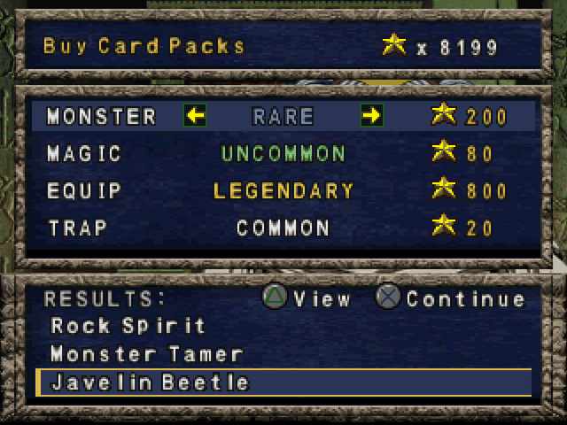

# Release notes

## 0.5.3

Extract this over your existing install as usual. Your saves, save states and
settings all carry over.

### Fixed: build failed with "disc ended early at stream offset 32518144"

If you picked the **.cue** file at first setup, the build stopped with two
lines reading `disc ended early at stream offset 32518144` and then
`Build failed. Fix the errors above, then rebuild manually.` Picking the .bin
instead worked, which is why that advice went around.

The setup accepts either file and the game itself prefers the .cue, but the
two steps that bake the rank sprites, the game font and the drop tables from
your disc read whatever was recorded as a raw image -- and a .cue is a
97-byte text file. They now resolve a .cue to the .bin it names (also when
the .bin was renamed or the dump is multi-track), and read a cooked .iso
correctly too. Either pick builds the same game, byte for byte.

A file that is not a disc at all is refused up front with a message naming
the file and what to pick instead, rather than a read that runs off its end.

### Fixed: "psxrecomp generate failed (exit 1)" after picking a renamed .cue

A .cue names its .bin inside the file. Rename both files and the .cue still
names the old .bin, so picking it stopped first-run setup at generate with
nothing more than "exit 1". The game itself already tolerated that by
mounting the .bin beside the .cue; setup now does the same, and so does the
step that checks your disc before generate. If the .bin really is missing,
the dialog now says which file the .cue is looking for instead of "exit 1".

The setup dialog now repeats the reason the generate step gave for any
failure, not just this one.

### New: Reset-Setup.bat

Double-click it inside the game folder to put an install back to "freshly
extracted": it removes the generated game code, the built game, the
remembered disc and BIOS picks, and optionally the downloaded build tools,
then the first-run setup runs again. Your disc image and your saves are
never touched. For anyone whose install is stuck no matter what they try.

### Changed: first-run setup no longer asks for a BIOS

This game ships with OpenBIOS built in and has only ever been tested with
it. The setup wizard used to offer an optional retail BIOS step anyway, and
would quietly adopt a SCPH1001 dump it found near the install. Both are
gone: setup asks for your disc and nothing else, the launcher has no BIOS
row, and a retail dump is never used even if one is present.

### Fixed: Steam Deck build stopped at "Could NOT find OpenGL"

On SteamOS the first-run build failed at the configure step with
`Could NOT find OpenGL (missing: OPENGL_INCLUDE_DIR)`. SteamOS ships the
OpenGL libraries but strips the headers, and CMake's OpenGL finder treats
the header directory as required even though nothing in this game reads
it -- the renderer and the launcher use SDL's own GL headers and load
everything newer than GL 1.1 at run time. The build now notices a host
with libraries but no headers and links the library directly. Nothing
changes on a machine that has the headers.

## 0.5.1

Extract this over your existing install as usual. Your saves, save states and
settings all carry over.

### Fixed: results screen showed only one card page

With Card drops at 2+, the results screen's CARD DROPS page could not be
paged: every Right press showed the first page of cards again. All cards
were being awarded correctly -- only the paging was broken. Fixed; the drop
behaviour still matches the community mod exactly.

## 0.5.0

Extract this over your existing install as usual. Your saves, save states and
settings all carry over.

### Card drops now match the community 15-card mod exactly

The Card drops row (MODS > Card drops) is not new -- but how it deals cards
is. We reverse engineered the community 15-card / 5-card drop mod from the
modded discs and copied its behaviour, drawing from the same
opponent-and-rank pool as stock. The RNG stream now matches the modded ISO
bit for bit, so a duel played here consumes the random sequence exactly like
the mod does: same seed, same actions, same cards, interoperable with the
community's seed tooling. Set to 1 it remains stock.

### New: RNG viewer (VIEW > RNG viewer)

A one-line overlay with the live random seed: the seed word, the absolute
call count since boot (the "seed number" -- solved from the seed itself, so
it is exact from the moment you switch it on), the calls consumed last
frame, and the seed latched just before the last duel started -- the number
the deck predictors search for. Read-only.

### Fixed: phantom fusion hint outside duels

The fusion hint read memory that only means "your hand" during a duel and
could dress leftover data up as a suggestion on other screens. It now draws
only inside an actual duel.
## 0.4.1

Extract this over your existing install as usual. Your saves, save states and
settings all carry over.

### Fixed: the mid-duel freeze

The duel could stop dead while the music kept playing and the frame rate stayed
pinned at full speed, usually just after the cards in your hand were processed.
It was intermittent: some players hit it readily, others never saw it once.

The game asks the CD-ROM for data and then, as a separate step, marks "a read is
in progress". On a real PlayStation the drive is far too slow for a read to
finish in the gap between those two steps. Here it sometimes did — so the game
marked a read that had *already* finished, and then waited forever for something
that had come and gone. Everything else about the duel stayed healthy, which is
why it looked frozen rather than crashed.

The build now recognises that exact state — the game waiting on a read the drive
has demonstrably completed — and releases it within about half a second. The
duel carries on by itself, with nothing abandoned. If this was happening to you,
it should stop.

Freeze reports are still written for anything this does not cover, and now
record how many of these were repaired, so a report that still arrives is a
genuinely different problem. Thank you to everyone who sent one: the save states
attached to those reports are the only reason this was findable.

### The menu, toasts and save-state screen have real text now

They were drawn with an 8x8 uppercase bitmap font blown up by a whole number, so
the bigger your display, the bigger the blocks. They now use proportional
antialiased type with lowercase, rendered at your window's real resolution,
along with rounded panels, a filled highlight on the selected row, and icons on
the menu bar.

Nothing about how the menus work has changed.

### macOS

macOS builds and completes a first run. It is **experimental** — the build is
developed and tested on Windows — but the documentation for it is in the README.
Thanks to @paulobiduss for the pull request.

### Optional: the Vulkan renderer

OpenGL remains the default and is the backend this build is tested on. Vulkan is
**experimental** and off unless you ask for it. It now composites the menu and
the game's other overlays, so it is worth a try if OpenGL misbehaves on your
hardware.

Two ways to enable it:

- Edit `menu_settings.ini` in your player-data folder
  (`Documents\My Games\Yu-Gi-Oh Forbidden Memories Recompiled`), uncomment the
  `renderer` line and set it to `2`:

      renderer=2      # 0 software, 1 opengl, 2 vulkan

  It takes effect the next time you launch.

- Or launch with `--renderer vulkan`, which overrides the file.

Set it back to `1`, or comment the line out, to return to OpenGL. One known
difference: with Vulkan, `GAME > SPEED` above 1x does not keep audio clean the
way OpenGL does.


## 0.4.0

Extract this over your existing install as usual. Your saves and settings are
unaffected — but **if you ever supplied a retail BIOS dump, read the first note
below**, because your save states are affected in that one case.

### Changed: everyone runs the same BIOS

This build ships OpenBIOS and now always uses it. A retail BIOS dump is no
longer accepted, and no longer needed.

The point is simplicity. The BIOS is compiled into the build, so a player on a
retail dump was running genuinely different code from everyone else on the same
version — and setup used to adopt one silently if a `SCPH1001.BIN` happened to
sit in any folder above the install. Keeping everyone on one image means a bug
one player hits is a bug another can reproduce.

- **Save states made under a retail BIOS will not load any more.** States are
  tied to the BIOS that made them. Your in-game saves — memory cards, the ones
  the game itself writes — are not affected and carry over fine. If a save
  state matters to you, load it and save in-game **before** updating.

Everyone who never supplied a dump is already on OpenBIOS and nothing changes.

### New: a report when a duel locks up

In order to further diagnose an unreproducible lockup during duels that some
players are experiencing, the game now spots it and leaves evidence behind.

If a duel stops advancing, a box says so on screen and the game writes
`freeze_report.txt` next to your saves, along with an automatic save state.
**Please send both to the Discord linked on the**
[**GitHub page**](https://github.com/Unchiga/YuGiOhForbiddenMemoriesRecomp).
Together they reproduce the lockup exactly, which is the one thing that has
been missing.

The automatic save state goes to the highest **free** slot and never overwrites
one of yours.

### Fixed: the fusion hint no longer draws over the card you are inspecting

Holding Triangle opens the full-screen card view. The hint kept drawing its
pick-order badges and result name straight through it, because the hand still
counts as pickable underneath. It now gets out of the way and comes back when
you let go.

### Fixed: no leave animation when `CONFIRM MENU CIRCLE EXIT` asks you first

Contributed by **yamyi**.

With that option on, pressing Circle started the screen's leave animation
before the confirmation box could stop it — so you saw the game begin to exit,
then get asked whether you wanted to. The opening Circle is now taken before
the screen sees it, so nothing moves until you answer.

## 0.3.9

Extract this over your existing install as usual. Saves, savestates and your
settings are unaffected.

### Changed: `VIDEO → VSYNC` now starts OFF

It used to start ON, which put everyone with a 60 Hz monitor onto a code path
that turned out to be wrong in two different ways — see the two fixes below.
Both are fixed, but OFF is the setting every report describes as smooth, so
that is where it now starts.

If you had already turned it off, nothing changes.

### Fixed: stutter on a 60 Hz monitor with vsync on

The game held a perfect 60 frames a second and still looked wrong, which is
what made this hard to pin down — every counter said it was fine.

With vsync on and a roughly 60 Hz monitor, the emulator handed its timing over
to your display and stood its own timer down. Measured over 300 frames, that
left individual frames lasting anywhere from 10 to 24 ms instead of a steady
16.7 — only about half landed where they should. The *average* stayed exactly
right, so nothing reported a problem while the picture visibly juddered.

The emulator's own timer now keeps time in every case. The same measurement
after the change: **100% of frames on target.**

### Fixed: `GAME → SPEED` above 1 ran at normal speed, with broken audio

On a 60 Hz monitor with vsync on, x2 ran at about x1 and the sound broke up
badly. The display was pacing the game at 60 frames a second when x2 needs
120, and the emulator had already halved its internal timing on the
assumption those frames would arrive — so the sound chip got half the time it
needed. Setting a speed while the game was running also did nothing at all
until something else happened to refresh it. Both fixed.

### Fixed: a card you already have in your deck no longer shows as `New!`

Winning a card you already own showed it as **New!** on the results page if
your only copies were in your deck. Building a deck moves cards out of your
trunk, so a card you play with and hold no spares of looked like one you had
never seen. It now counts your deck as well.

## 0.3.8

Extract this over your existing install as usual. Saves, savestates and your
settings are unaffected.

### New: `MODS → CONFIRM MENU CIRCLE EXIT`

Contributed by **yamyi**.

On the mode-select screen — CAMPAIGN, FREE DUEL, BUILD DECK, LIBRARY, PASSWORD,
SAVE — Circle drops you straight back to the title menu with no confirmation,
so one stray press loses your place.

The new row raises a **RETURN TO TITLE?** prompt instead. Cross confirms,
Circle cancels, Left and Right choose, and **NO is the default**, so a mistaken
press costs nothing. The prompt is drawn from the game's own artwork — the
password screen's box and the card-name font — so it looks like something the
game shipped with.

The row ships **on**. Turn it off and Circle behaves exactly as it always did.

### Fixed: the fusion hint suggested combinations that do not fuse

`VIEW → FUSION HINT` could recommend three cards ending on a big monster that
fuses with nothing — the reported case was Amazon of the Seas, then Tentacle
Plant, then **Gate Guardian**, offered as a 3750 attack "fusion".

The first two really do fuse. The third does not, and when a card does not
fuse the game simply leaves it standing — so the hint was scoring the line at
Gate Guardian's own printed attack and calling it the best fusion in the hand.
Following it discarded two cards to play a card that was already playable on
its own.

The hint now only offers a line whose **last** step is a real fusion. Some
hands that used to show a suggestion will correctly show none: that means
there was never a fusion there, only a big card the hint was dressing up.

### Fixed: the game could run too fast while a screen sat still

Reported while viewing a card and while standing on the overworld, with
`GAME → SPEED` set to 1. Turning vsync off made it behave.

The emulator holds 60 Hz one of two ways: a wall-clock timer, or by letting
your display's vsync do it. When vsync was doing it — vsync on, and a display
running at about 60 Hz — the timer stands down so the two cannot fight. But a
screen that never changes skips being redrawn at all, and with nothing being
drawn there was no vsync to wait for either, so nothing was holding the speed
down.

Still screens are exactly where it showed: a duel is always animating, so it
kept being redrawn and kept its timing. Now the picture is always sent when
vsync is the one keeping time.

This only ever affected vsync on together with a roughly 60 Hz display. If you
had vsync off, or a 120/144/240 Hz display, nothing about your setup changes.

## 0.3.7

Extract this over your existing install as usual. Saves, savestates and your
settings are unaffected — but see the note at the end of this section if you
already have a `card_name_color.ini`.

### `CARD NAME COLOR` weighs how hard the duelist is, not just the odds

Contributed by **yamyi**.

0.3.6 read a card's rarity as its **best raw drop odds anywhere** — the single
highest weight any one duelist gives it. That treats a generous drop from
Nitemare exactly like an equally generous drop from a Villager, which is not
what "rare" feels like when you are actually farming it.

Rarity is now a **score**, not a raw weight:

```
score = drop weight  ×  duelist multiplier  ×  rank-band multiplier
```

A card still takes the best score it reaches anywhere — same "best odds win"
idea as before — but a hard opponent's drops now count as scarcer than an easy
opponent's at the same weight.

The shipped duelist tiers run **tutorial ×2**, **rookie ×1.5**, **normal ×1**,
**tough ×0.75**, **boss ×0.5**, **superboss ×0.25**, so a card you can only
realistically get off Seto 3rd, DarkNite, Nitemare or Duel Master K reads
several tiers rarer than the same weight off Jono. The three rank bands are
weighted too: **S/A POW ×0.75**, **B/C/D ×1**, **S/A TEC ×0.5**.

All of it is tunable. `card_name_color.ini` gains three sections:

```ini
[duelist_tier_multipliers]
superboss = 0.25

[duelist_tiers]
Nitemare = superboss

[rank_multipliers]
s_a_tec = 0.5
```

Set every multiplier to `1` and you get 0.3.6's plain max-weight behaviour
back exactly. The tier thresholds moved to suit the new scale
(`2 / 5 / 7 / 11 / 16`), and as before it is the *numbers* that decide the
rarity order, not the tier names.

As it ships, colour again marks out the scarce end of the collection: roughly
230 of the 722 cards take a colour on a fresh install and the rest stay white.
A ladder nearer `0 / 13 / 26 / 40 / 58` spreads the six tiers evenly across
everything, if that is what you would rather see.

### If you already have a `card_name_color.ini`

**It is kept, and it is not upgraded.** The file is only written when it is
absent, so an existing one keeps its 0.3.6 thresholds and never gains the three
new sections — you get the new duelist and rank weighting applied against the
old numbers, which colours rather more of the collection than a fresh install
does, and you cannot tune the new multipliers until the sections exist.

**Delete the file to get a current one.** It is rewritten on the next launch,
with every new section present and all 722 cards listed for pinning. Worth
saving any `[cards]` pins you want to keep first.

## 0.3.6

Extract this over your existing install as usual. Saves, savestates and your
settings are unaffected.

### New: `MODS → CARD NAME COLOR`

Contributed by **yamyi**, who also brought widescreen in 0.3.1.

A card's name is tinted by how hard that card is to farm, so the chest, the
deck builder and every card screen tell you at a glance what is worth keeping.
It is **on by default** — it only ever changes the colour of text, never what
the game does.

Rarity here is the card's **best drop odds anywhere**: the single highest
weight any one duelist gives it, out of 2048. That is deliberately not "how
many duelists drop it" — a card twenty duelists each drop at a sliver is
harder to farm than one that only two drop generously, and only the best-odds
reading tells those apart. It comes from the same drop data baked from your
disc that the Drop Table Manager and CARD SHOP already use.

Six tiers, rarest first: **legendary** (blue), **ultra_rare** (red),
**super_rare** (orange), **rare** (yellow), **uncommon** (green) and
**default** (white). The 82 cards no duelist drops at all are legendary, which
is what makes Exodia's legs blue.

As it ships, colour marks out the scarce tail and the bulk of the collection
stays white — about 290 of the 722 cards take a colour. If you would rather
the tiers spread evenly across everything, that is one file away.

**Every threshold and every colour is yours to change.** The mod writes
`card_name_color.ini` next to your saves on first run:

```ini
[tiers]
legendary_threshold   = 2
legendary_color       = blue
ultra_rare_threshold  = 8
ultra_rare_color      = red
```

The *numbers* decide the rarity order, not the tier names — put
`uncommon_threshold` below `legendary_threshold` and uncommon genuinely
becomes the rarest tier. A ladder of `0 / 13 / 26 / 40 / 58`, for instance,
puts roughly a sixth of the collection in each band.

The file also lists **all 722 cards** commented out under `[cards]`, so pinning
one card to a colour regardless of its drop rate is a matter of uncommenting a
line:

```ini
[cards]
Blue-eyes White Dragon = blue
```

Names are matched against the game's own text, so no pin can go stale.

Note for anyone editing colours by hand: this engine has **seven** usable text
colours (0–6 — white, yellow, orange, red, blue, green, grey). Numbers above
that do not render as a new colour, they render as nothing or as garbage.

## 0.3.5

Extract this over your existing install as usual. Saves, savestates and your
settings are unaffected.

### New: `AUDIO → AUTO SLOW FOR AUDIO`, and it starts off

`GAME → SPEED` runs the game faster without speeding the music up. When a scene
is heavy enough that your machine cannot hold the faster cadence, the emulator
used to quietly step the speed back down to protect the sound.

That is now a choice, and it is **off by default**. You keep the speed you
picked; if a scene is too heavy for it, the sound is what suffers. Turn the new
row on to have the emulator ease the speed down instead — a dip in speed rather
than sound that breaks up. On a machine that can hold the speed you asked for,
neither setting does anything at all.

### Fixed: setup failed after moving the extracted folder

Extracting the release, running setup, and then moving the folder somewhere
else — Downloads to Desktop, typically — made the next run fail with

```
CMake step for psx_libchdr failed: 1
```

and a wall of CMake output that explained neither what was wrong nor what to do
about it. A build tree records the absolute path it was configured in, so moving
one invalidates it. Setup now notices and starts that step fresh instead of
failing.

If you hit this on 0.3.3 or 0.3.4, deleting the `build-release` folder inside
the moved copy fixes it without needing this update.

## 0.3.4

Extract this over your existing install as usual. Saves, savestates and your
`card_shop.ini` are unaffected.

### Fixed: the card shop refused to sell, saying NO SAVE LOADED

The shop checks that a real save is resident before it will take your
starchips, and its check was too strict: as well as requiring the 40 cards in
your deck to be valid, it required them to be stored in ascending card-id
order. Nothing guarantees that. Every save this was developed against happened
to be in that order, so the extra rule never showed up here — but any player
whose deck sat in a different order was told **NO SAVE LOADED** on a perfectly
good save and could not buy anything.

The shop now shares the same save check the CHEATS rows use, which is the one
that was actually measured against a dozen different saves.

### Fixed: Exodia's head could be bought from an 80-starchip pack

`card_shop.ini` pins cards to a rarity by name, and the pin for the head read
`Exodia the Forbidden One`. The game's own name for it is **`Exodia the
Forbidden`** — no "One", unlike its four limbs — so the pin matched nothing and
the head fell through to the ATK band. At 1000 ATK that put the game's win
condition in the cheapest **UNCOMMON** monster pack. It is legendary now, as
intended.

If you already have a `card_shop.ini`, it still holds the old spelling. Fix
that one line to `Exodia the Forbidden = legendary`, or delete the file to get
a fresh one — the rest of your edits are worth keeping.

## 0.3.3

Extract this over your existing install as usual. Saves, savestates and your
`card_shop.ini` from 0.3.2 are unaffected.

### CARD SHOP is finished — `MODS → CARD SHOP`



0.3.2 shipped it as `CARD SHOP WIP`. The WIP is gone: the shop now works the
same at **all three** of the game's shopkeepers and its card viewer is
indistinguishable from the deck builder's.

**It works at every shop now.** The row was only appearing at the campaign
shop. The other two — the tournament's card convention and the third — opened
their menu before the mod had staged its labels, so `CARD SHOP` simply was not
in the list. It is staged from the moment the game is running now, so whichever
shopkeeper you walk up to has it.

**Cards look right in the viewer.** TRIANGLE on a card you just bought opens
the game's own card viewer, and at the two shops that never stock its art that
came up as a bare face over an empty frame — no name plate, no card body, no
stone panels, no orb, no stars, no ATK/DFD, and the flip-in animation playing
with half a card back. All of it is baked from your disc and lent to the viewer
for as long as it is open, then handed back. Monsters, magic, equip, traps and
rituals all read correctly, at every shop.

**The pack-open ceremony reads better.** Every card a pack will yield shows as
an empty slot from the moment you buy, so you can see how many are coming and
each **X** fills one. The highlight no longer draws a line through the name it
is highlighting, the rows have room to breathe, and the button legend is
honest: **X** says *Next* while cards are still turning over and *Continue*
once they are all up, and **X BUY / O CLOSE** comes back afterwards instead of
leaving the panel with no legend at all.

`cards` in `card_shop.ini` is limited to 1–3, which is what the results box can
print. It used to accept 5 and hand you two cards it never showed you.

### Fixed: the save-state menu could be hidden behind the game

**F7** opened the slot list and took your keys, but anything the mods drew in
the game's own picture — the card shop's panel most obviously — was composited
on top of it, so on a full-screen panel you could not see the menu you were
driving. Menus, the rewind bar and the volume readout now sit above everything
the game is wearing.

## 0.3.2

Extract this over your existing install as usual. Saves and savestates from
0.3.1 are unaffected.

### New: game speed that keeps the music in tune — `GAME → SPEED`

Speed up or slow down the game **without the audio changing pitch**. The
speed control scales the frame pacer and the console's video timing
together, so the sound hardware's own clock never moves: music and effects
play at their proper pitch whether you are running at half speed or double.
Handy for grinding drops at speed, or slowing a duel down to read what the
opponent just did.

### Improved: sound effects respond faster

The delay between pressing a button and hearing the game answer is down
from roughly **170 ms to about 60 ms**. Menus feel considerably crisper.

### Fixed: CARD DROPS listed the previous duel's cards after a loss

The extra results page describes what a duel awarded, and a duel you LOSE
awards nothing — but the page kept showing the cards from the last duel you
won. It now forgets a duel's cards once you leave its results screen, so a
loss shows nothing. The chest's "New!" marking is unaffected.

### New, and unfinished: CARD SHOP — `MODS → CARD SHOP WIP`

**Off by default, and marked WIP for a reason: it is still being built.**
Turn it on and the shopkeeper's menu grows a fifth row, CARD SHOP, that
buys card packs with your starchips.

What is there today: the shopkeeper asks what you are looking for in his
own textbox; four pack types (monster, magic, equip, trap) across four
rarities — common, uncommon, rare and legendary — priced 20 / 80 / 200 /
800 starchips; every one of the game's 722 cards sits in a pool, so
anything can be pulled. Buying deals the pack out one card at a time,
and once the cards are face up you can pick one and press TRIANGLE to
open the game's own card viewer on it. Cards land in your trunk marked
"New!", exactly like a duel drop.

Prices, rarity bands and individual card placements are yours to edit:
the shop writes **`card_shop.ini`** next to your saves the first time it
runs, and re-reads it whenever you leave and re-enter the shop.

Expect rough edges — that is what WIP means here. Feedback welcome.

## 0.3.1

Extract this over your existing install as usual. Saves and savestates from
0.3.0 are unaffected.

### Fixed: duelist portraits in the Drop Table Manager

**0.3.0 shipped with every portrait plate empty.** The portraits are Konami's
art, so they are never in the download — but 0.3.0 had no way to get them at
all: the capture only existed as a developer tool, so player builds drew
plain plates everywhere.

Now **the game captures its own portraits, from its own screen.** Open FREE
DUEL and move through the opponent list once; every portrait on screen is
captured as you go, the Manager fills in live if it is open, and the set is
kept next to your saves (`duelist_icons.bin`) so it is there for good.

Nothing changes about what ships: the art comes from your machine, your
disc, your screen, and never leaves.

**A duelist your campaign never met draws nothing on that screen**, so
their plate stays empty until you meet them — the Manager fills in as
your campaign does. The portraits live in the Manager's own cache, never
in your save.

### New: Widescreen (experimental) — `VIEW → WIDESCREEN`

Contributed by **yamyi** — this project's first outside contribution.
Projected 3D (the duel field) renders genuinely wider at 16:9; flat 2D
screens stay 4:3, pillarboxed rather than stretched. Toggle it in the VIEW
menu or enable the `psx.enhancement.widescreen` mod-catalog feature; the
toggle reshapes the window live. Works with both `VIDEO → SCALING` modes:
FILL WINDOW stretches to fit, INTEGER keeps whole pixels and snaps the
wide frame to the largest multiple that fits. Overlays that ride the
duel screen (the rank badge, the fusion hint) stay anchored to the boxes
they label in wide mode, and menu screens no longer pulse between wide
and 4:3 after a duel (the FREE DUEL cursor's sparkle was misread as 3D
for a moment every couple of seconds). Experimental: culling pop-in at
the wide edges has not been fully checked for this title.

### Fixed: first-run build error on machines with the Vulkan SDK

If 0.3.0's first-run setup failed for you with
`error: use of undeclared identifier 'cpu'` (around main.cpp:13332) and
`no matching function for call to 'psx_netplay_bind_cpu'`, this release
fixes it. The CPU state variable was accidentally guarded out of the
build exactly when a Vulkan SDK was detected on your machine, so setups
on machines with the LunarG SDK installed could not compile. 0.3.0
workaround, if you need one before updating: temporarily clear the
`VULKAN_SDK` environment variable and re-run the setup.

## 0.3.0

Extract this over your existing install as usual. Your saves live in
`Documents\My Games\Yu-Gi-Oh Forbidden Memories Recompiled` and nothing this
update writes can reach them.

> **Save STATES from 0.2.x will not load** in this version — the recompiler
> itself changed underneath them (see *Framework* below) and the loader
> refuses a state made by different codegen rather than resuming into it.
> **Memory-card saves are unaffected** and carry over as always. If you have
> a savestate you care about, open it in 0.2.6 once and save in-game first.

### New: the Drop Table Manager — `VIEW → DROP TABLE MANAGER`

The drop table viewer grew into a **manager**: it no longer just shows every
duelist's drop table — **you can rewrite them, and the game rolls what you
wrote.**

- **Edit anything.** Click a weight and type a new one; click the rank cell
  to move a drop between S/A POW, B/C/D and S/A TEC. Right-click any row for
  add / move / remove. Drag a card from the list and drop it on a duelist to
  add it — the new `ALL CPU` toggle lists every duelist under a card, greyed
  where they do not drop it, so all 39 are drop targets without switching
  views.
- **The math stays honest.** Every band always totals exactly 2048 — the
  invariant the game's own drop roll assumes — so whatever you add or grow
  comes off that duelist's other drops in proportion, and an edit that cannot
  balance is refused with a message instead of fudged.
- **Nothing sticks until you press `SAVE`**, which writes
  `drop_table_edits.ini` next to your saves — hand-editable, same shape as
  the DROP MISSING CARDS file. `DEFAULTS` returns the selected duelist to
  stock (stock *plus* the mod, if that row is on: your edits layer cleanly on
  top of it, in the window and in the game alike).
- **Share your tables.** `LOAD → EXPORT CURRENT` writes a timestamped file
  into `drop_tables\` beside your saves; anyone can drop that file into their
  own `drop_tables\` folder and pick it from `LOAD`. Loading, too, is nothing
  until saved.
- Quality of life throughout: scrollbars in both panes (722 cards is a lot
  of mouse wheel), TYPE and DROPS columns with full column sorting in every
  pane, a blinking search caret, hover highlights, and `N-M OF K` position
  indicators.
- Fixed: hovering the manager's window while it overlapped the game no
  longer hovers the game's F10 menu underneath it.

### Framework catch-up

The bundled PSXRecomp framework caught up with 53 upstream commits. The
headline gains: an LWL/LWR load-delay fix in the recompiler (a real
correctness class, and the reason old savestates are refused), the PGXP
Precision mod (framework-owned, off by default), SPU voice address
alignment, CD-DA position-report interrupts, and a fix for vsync and the
frame pacer double-blocking presents.

## 0.2.6

Extract this over your existing install as usual. Your saves live in
`Documents\My Games\Yu-Gi-Oh Forbidden Memories Recompiled` from 0.2.3 onward,
so nothing this update writes can reach them.

### New: `MODS → DROP MISSING CARDS`

**82 of the game's 722 cards are dropped by nobody.** Both of Exodia's legs are
among them, which is why the card list cannot be completed by duelling in the
stock game. Turn this on and every one of them has a source.

Nothing on your disc is touched. A duel loads the current opponent's drop
weights into memory, and this rewrites that copy — so the change lasts exactly
as long as the duel does.

The placement is yours to change. On first run it writes
**`drop_missing_cards.ini`** next to your saves, listing every card by name
under the duelist that drops it:

```ini
[Weevil Underwood]
52  =  30,  20,   0   ; Hercules Beetle
278 =  30,  20,   0   ; Petit Moth
```

The three numbers are the S/A POW, B/C/D and S/A TEC rates, as weights out of
2048 — 20 is about 1%. Each band always totals 2048, so whatever you add comes
off that duelist's normal drops in proportion. The shipped table adds about 1–6%
per duelist, which you will not notice. Delete the file to get the defaults
back.

### Fixed: `CHEATS → ALL CARDS` before the title screen

**Turning `ALL CARDS` on during the Konami logos or the intro movie distorted
the picture and then froze the game.** It never reached the title. This is in
0.2.5 too.

The row writes card counts to three places in memory, and one of those is only
the card chest's working buffer while the chest is the screen you are on. Before
a save is loaded it belongs to the intro instead, so the row was writing over
the movie as it played.

The three rows that write save data — `ALL CARDS`, `STARCHIPS` and
`FREE SPENDING` — now check that a save is actually loaded first, and say
"load a save first" instead of doing anything if it is not. `ALL CARDS` also
leaves the chest's buffer alone unless it really is the chest's buffer, which
means the same mistake cannot corrupt a duel or a shop screen either.

### No more startup toast for cheats you never touched

Stored cheat settings are re-applied as the game starts, and the two reveal rows
announced themselves while that happened — every launch opened with
"Their cards: face up", even when the setting was OFF and nothing had changed.
The message is still there when you move the row yourself.

## 0.2.5

Extract this over your existing install as usual. Your saves live in
`Documents\My Games\Yu-Gi-Oh Forbidden Memories Recompiled` from 0.2.3 onward,
so nothing this update writes can reach them.

### Updates now actually rebuild

**If your install folder has brackets in its name — `ygofm-0.2.5-win-x64(1)`,
which is what your browser makes the second time you download the same zip —
every update so far has silently done nothing.** You would extract the new
version, launch it, watch it generate, and still be playing the old build. No
error, anywhere.

The updater hands off to a rebuild step that has to run after the game exits.
That handoff lost the folder path at the first bracket, so the rebuild never
started. Fixed. A `&` in the folder name broke it the same way.

If you are on a broken install right now, this release repairs it — extract it
over the top and launch it once. It will rebuild, and that first launch takes a
few minutes.

### Two new cheats — `CHEATS`

**`SHOW OPPONENT HAND`.** See what the CPU is holding.

**`FORCE FACE UP`.** The computer sets cards face down constantly and you are
meant to guess. With this on, anything it sets plays face up instead — and
cards already sitting face down on its field turn over too, the next time the
view redraws.

### Fusion Assistant

Equips are worth what they add. Equips such as 'Megamorph' weren't being
properly considered, fixed.

### `VIDEO → WINDOWED SCALE` is a slider

It was a cycling option: eight presses to get from 3x to 7x, reading the label
after each one. It is now a track with a notch per step — drag it, click
anywhere on it, or type a value.

### Disc timing: a stability fix

Duels would occasionally freeze while fast loading was set to INSTANT, fixed.

## 0.2.4

> **About 0.2.3:** it was published and withdrawn within about five minutes and
> was not stable — its launch-time update check silently disabled itself. If
> you happened to grab it, replace it with this build. Everything below applies
> to 0.2.4, and 0.2.3 is best treated as never having shipped.

**Read this if you are updating from 0.2.2 or earlier — it affects your saves.**

### Install this update over your existing folder

Extract this release **on top of your current install**, replacing the files
when Windows asks. That is the whole procedure, and it is what lets the game
find your existing saves.

On the first launch after that, the game copies your memory cards and save
states out of the game folder and into

```
Documents\My Games\Yu-Gi-Oh Forbidden Memories Recompiled
```

You do not have to move anything yourself. The originals are **copied, not
moved** — they stay in the old folder untouched, so nothing is lost if
something goes wrong or you want to go back.

### If you extracted somewhere else instead

Your saves are not gone. They are still sitting in your old game folder,
where every previous version kept them. Copy these from the **old** folder
into `Documents\My Games\Yu-Gi-Oh Forbidden Memories Recompiled`:

- `card1.mcd`, `card2.mcd` — memory cards
- the `saves\` folder (its `openbios\` subfolder holds your save states)

Then launch the game again.

### After this, updates stop being fragile

From 0.2.3 onward your saves live outside the game folder for good. Later
updates can be extracted anywhere — over the top, into a fresh folder, it no
longer matters, because nothing an update writes can reach them.

Before this change, saves survived an update only because the release archive
happened not to contain a `saves\` folder, and extracting into a new folder
silently left every save behind. That is what this release fixes.

Running the game off a USB stick or a shared machine? Put an empty file named
`portable.txt` next to the exe (or set `PSX_PORTABLE=1`) and everything stays
in the game folder as before.

---

### Also in this release

**Update notifications.** The game now checks for a newer release each time it
starts and offers to open the download page. It never downloads or installs
anything by itself. Set `update_check=0` in `menu_settings.ini` to turn the
check off entirely — with that set, no request is made at all.

**VIDEO > WINDOWED SCALE.** A new option under SCREEN, 1x to 8x, default 3x.
It resizes the window so the picture is an exact whole-number multiple of the
original 320x240 — at 3x that is a 960x720 picture with no blurring and no
uneven pixels. It applies when SCREEN is WINDOWED and SCALING is INTEGER; the
row says so when it is not.

**The menu bar no longer covers the game.** The picture was being drawn behind
the menu bar instead of below it, so the top of the screen was hidden and the
image sat off-centre. Maximising changed how much was covered but never fixed
it.
